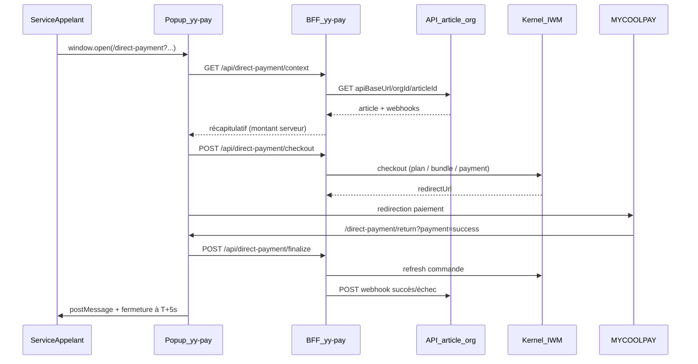

# Intégration paiement direct — YowYob Payment

Ce document décrit comment intégrer **YowYob Payment (yy-pay)** depuis un service externe (ERP, marketplace, portail métier, etc.) pour encaisser un paiement dans une **fenêtre popup**, avec notification webhook vers votre organisation.

> **Moyen de paiement — depuis le portefeuille.** L'achat est réglé **avec le solde du portefeuille YowYob** de l'utilisateur connecté, jamais par Orange Money / MTN MoMo / Stripe en direct. Si le solde ne couvre pas le montant, la fenêtre propose de **recharger exactement le différentiel manquant** (là, et seulement là, un opérateur mobile intervient pour créditer le portefeuille), puis l'utilisateur revient régler l'achat depuis son solde reconstitué. La connexion exige le **MFA** : tout détenteur de portefeuille doit l'avoir activé. Le contrat d'ouverture de la popup (paramètres, `postMessage`, webhook) reste inchangé — seul le mécanisme interne de règlement diffère.

---

## Table des matières

1. [Vue d'ensemble](#1-vue-densemble)
2. [Prérequis](#2-prérequis)
3. [Ouverture en popup](#3-ouverture-en-popup)
4. [URL de paiement direct](#4-url-de-paiement-direct)
5. [API article organisation](#5-api-article-organisation)
6. [Modes d'achat](#6-modes-dachat)
7. [Flux détaillé](#7-flux-détaillé)
8. [Routes BFF yy-pay](#8-routes-bff-yy-pay)
9. [Webhooks organisation](#9-webhooks-organisation)
10. [postMessage navigateur](#10-postmessage-navigateur)
11. [Sécurité](#11-sécurité)
12. [Variables d'environnement yy-pay](#12-variables-denvironnement-yy-pay)
13. [Exemples complets](#13-exemples-complets)
14. [Matrice d'erreurs](#14-matrice-derreurs)
15. [Limites connues](#15-limites-connues)

---

## 1. Vue d'ensemble



**Principes clés :**

- Le **montant n'est jamais fourni par le front** appelant : il est recalculé côté yy-pay à partir de l'API article de l'organisation.
- L'utilisateur doit être **authentifié** (login MFA yy-pay si nécessaire).
- Après paiement, la popup affiche le résultat puis **se ferme automatiquement après exactement 5 secondes**.
- Votre organisation reçoit un **webhook HTTP** de succès ou d'échec.

---

## 2. Prérequis

### Côté organisation (vous)

1. Exposer une **API article** : `GET {apiBaseUrl}/{orgId}/{articleId}`
2. Exposer deux **webhooks** (URLs renvoyées dans la réponse article) :
   - webhook succès
   - webhook échec
3. Choisir le **mode** d'achat : `for_org` ou `of_org` (voir section 6)

### Côté yy-pay (plateforme)

- Instance yy-pay accessible en HTTPS
- Kernel IWM configuré (`IWM_API_BASE_URL`, `IWM_CLIENT_ID`, `IWM_API_KEY`)
- Le `X-Tenant-Id` est obtenu via `POST /api/auth/discover-contexts` (cookie session), pas via une variable d'environnement
- Callbacks MYCOOLPAY pointant vers yy-pay

---

## 3. Ouverture en popup

Depuis votre application, ouvrez yy-pay dans une nouvelle fenêtre :

```javascript
function openYyPayCheckout(params) {
  const url = new URL("https://yy-pay.example.com/direct-payment");

  url.searchParams.set("userId", params.userId);
  url.searchParams.set("articleId", params.articleId);
  url.searchParams.set("orgId", params.orgId);
  url.searchParams.set("qte", String(params.quantity));
  url.searchParams.set("mode", params.mode); // for_org | of_org
  url.searchParams.set("apiBaseUrl", params.apiBaseUrl);

  if (params.reference) {
    url.searchParams.set("reference", params.reference);
  }
  if (params.returnUrl) {
    url.searchParams.set("returnUrl", params.returnUrl);
  }
  if (params.orgApiKey) {
    url.searchParams.set("orgApiKey", params.orgApiKey);
  }

  const popup = window.open(
    url.toString(),
    "yypay",
    "width=480,height=720,scrollbars=yes,resizable=yes",
  );

  if (!popup) {
    throw new Error("Popup bloquée par le navigateur");
  }

  return popup;
}
```

Écoutez le retour via `postMessage` (voir section 10).

---

## 4. URL de paiement direct

### Endpoint

```text
GET https://{yy_pay_base_url}/direct-payment
```

### Paramètres obligatoires

| Paramètre | Type | Description |
|-----------|------|-------------|
| `userId` | string | Identifiant utilisateur métier (référence acheteur) |
| `articleId` | string | Identifiant article côté organisation |
| `orgId` | UUID | Identifiant organisation Kernel |
| `qte` | entier > 0 | Quantité achetée |
| `mode` | `for_org` \| `of_org` | Mode d'achat (voir section 6) |
| `apiBaseUrl` | URL | Base de votre API article (sans slash final) |

### Paramètres optionnels

| Paramètre | Type | Description |
|-----------|------|-------------|
| `reference` | string | Référence commande côté appelant (idempotency / traçabilité) |
| `returnUrl` | URL | Origine autorisée pour `postMessage` |
| `orgApiKey` | string | Clé API transmise à votre endpoint article (`X-Api-Key`) |

### Exemple

```text
https://yy-pay.example.com/direct-payment?userId=actor-uuid&articleId=SKU-42&orgId=11111111-1111-1111-1111-111111111111&qte=2&mode=for_org&apiBaseUrl=https://api.mon-org.com&reference=CMD-2026-001&returnUrl=https://app.mon-org.com
```

---

## 5. API article organisation

### Contrat à implémenter

```http
GET {apiBaseUrl}/{orgId}/{articleId}
Accept: application/json
```

**Headers optionnels que yy-pay peut envoyer :**

```http
Accept: application/json
User-Agent: YowYob-Payment/1.0
X-Request-Id: <uuid>
X-Api-Key: <orgApiKey>   # si orgApiKey fourni dans l'URL de paiement
```

### Réponse 200 (JSON)

```json
{
  "articleId": "SKU-42",
  "organizationId": "11111111-1111-1111-1111-111111111111",
  "label": "Abonnement Comptabilité",
  "description": "Accès module comptabilité mensuel",
  "unitAmount": 1000,
  "currency": "XAF",
  "serviceCode": "ACCOUNTING",
  "planCode": null,
  "billingPeriod": "MONTHLY",
  "addOnCodes": [],
  "successWebhookUrl": "https://api.mon-org.com/webhooks/payment/success",
  "failureWebhookUrl": "https://api.mon-org.com/webhooks/payment/failure",
  "metadata": {
    "sku": "SKU-42"
  }
}
```

### Champs

| Champ | Obligatoire | Description |
|-------|-------------|-------------|
| `articleId` | oui | Doit correspondre au paramètre URL |
| `organizationId` | oui | Doit correspondre à `orgId` |
| `label` | oui | Libellé affiché dans la popup |
| `description` | non | Description complémentaire |
| `unitAmount` | oui | Prix unitaire validé côté serveur (> 0) |
| `currency` | oui | Ex. `XAF` |
| `serviceCode` | conditionnel | Code service Kernel (mode `for_org` sans `planCode`) |
| `planCode` | conditionnel | Code plan commercial (mode `for_org`) |
| `billingPeriod` | non | `MONTHLY` (défaut) ou `YEARLY` |
| `addOnCodes` | non | Options plan commercial |
| `successWebhookUrl` | oui | URL webhook succès |
| `failureWebhookUrl` | oui | URL webhook échec |
| `metadata` | non | Données libres renvoyées dans le webhook |

### Calcul du montant final

```text
totalAmount = unitAmount × qte
```

`qte` provient de l'URL `/direct-payment`, recalculée côté yy-pay à chaque appel (context + checkout).

### Erreurs API article

| Code HTTP | Signification |
|-----------|---------------|
| 404 | Article introuvable |
| 400 | Paramètres invalides |
| 401/403 | Authentification refusée |
| 5xx | Erreur serveur organisation |

---

## 6. Modes d'achat

Le paramètre URL `mode` pilote le comportement métier.

### `for_org` — Achat **pour** l'organisation

L'utilisateur achète un service/plan **au bénéfice de l'organisation** (activation plan ou bundle services).

**Routage Kernel (yy-pay) :**

| Condition article | Route Kernel utilisée |
|-------------------|----------------------|
| `planCode` renseigné | `POST /api/plans/{planCode}/checkout` |
| `serviceCode` renseigné | `POST /api/service-bundles/checkout` |
| Sinon | `POST /api/payments/orders` (paiement générique) |

### `of_org` — Achat **d'un service de** l'organisation

L'utilisateur paie un article vendu par l'organisation. L'argent transite par MYCOOLPAY (compte plateforme), puis yy-pay tente de **créditer le wallet organisation** (`ownerId = organizationId`).

**Routage Kernel :**

- Encaissement : `POST /api/payments/orders`
- Post-paiement : résolution wallet `GET /api/payments/wallets/owner/{organizationId}`
- Création si absent : `POST /api/payments/wallets`
- Crédit : `POST /api/payments/wallets/{walletId}/credit` *(si exposé par le Kernel)*

> **Important :** si la route `/credit` n'est pas encore disponible côté Kernel, le paiement reste confirmé et le webhook org est envoyé, mais le crédit automatique du wallet peut échouer. Voir section 15.

---

## 7. Flux détaillé

### Étape 1 — Ouverture popup

Le service appelant ouvre `/direct-payment` avec tous les paramètres.

### Étape 2 — Authentification

Si l'utilisateur n'est pas connecté, yy-pay redirige vers :

```text
/login?returnTo=/direct-payment?<params encodés>
```

Après MFA, l'utilisateur revient automatiquement sur le paiement.

### Étape 3 — Résolution article

```http
GET /api/direct-payment/context?userId=...&articleId=...&orgId=...&qte=...&mode=...&apiBaseUrl=...
Cookie: yy_pay_access_token=...
```

### Étape 4 — Checkout

```http
POST /api/direct-payment/checkout?<mêmes query params>
Cookie: yy_pay_access_token=...
```

Réponse :

```json
{
  "success": true,
  "data": {
    "orderId": "uuid",
    "orderType": "plan",
    "paymentOrderId": "uuid",
    "redirectUrl": "https://my-coolpay.com/...",
    "session": { "...": "..." }
  }
}
```

Le front stocke `session` en `sessionStorage` puis redirige vers `redirectUrl` (MYCOOLPAY).

### Étape 5 — Retour MYCOOLPAY

MYCOOLPAY redirige vers :

```text
/direct-payment/return?payment=success
```

ou

```text
/direct-payment/return?payment=failure
```

### Étape 6 — Finalisation

```http
POST /api/direct-payment/finalize
Content-Type: application/json
Cookie: yy_pay_access_token=...

{
  "session": { "...": "session stockée" },
  "paymentReturn": "success"
}
```

Actions serveur :

1. Refresh statut provider (plan / bundle / payment order)
2. Si `mode=of_org` et succès : crédit wallet organisation
3. Notification webhook org (succès ou échec)

### Étape 7 — Fermeture popup

La page `/direct-payment/return` :

1. Affiche le résultat
2. Envoie `postMessage` à `window.opener`
3. Ferme la fenêtre **exactement 5 secondes** après l'affichage du résultat final

---

## 8. Routes BFF yy-pay

| Méthode | Route | Auth | Description |
|---------|-------|------|-------------|
| GET | `/api/direct-payment/context` | Cookie session | Résout l'article et calcule le total |
| POST | `/api/direct-payment/checkout` | Cookie session | Lance le checkout MYCOOLPAY |
| POST | `/api/direct-payment/finalize` | Cookie session | Refresh + webhook + crédit wallet org |

**Headers vers Kernel IWM (côté serveur yy-pay) :**

```http
X-Client-Id: <IWM_CLIENT_ID>
X-Api-Key: <IWM_API_KEY>
X-Tenant-Id: <tenantId depuis cookie session, via discover-contexts>
Authorization: Bearer <access_token utilisateur>
Content-Type: application/json
```

---

## 9. Webhooks organisation

Après finalisation, yy-pay appelle **votre** URL de webhook.

### Headers envoyés par yy-pay

```http
Content-Type: application/json
Accept: application/json
User-Agent: YowYob-Payment/1.0
X-YyPay-Event: payment.success
X-YyPay-Delivery-Id: <uuid>
```

### Payload succès

```json
{
  "event": "payment.success",
  "paymentOrderId": "payment-order-uuid",
  "orderId": "commercial-order-uuid",
  "organizationId": "11111111-1111-1111-1111-111111111111",
  "articleId": "SKU-42",
  "userId": "actor-uuid",
  "mode": "for_org",
  "amount": 2000,
  "currency": "XAF",
  "quantity": 2,
  "reference": "CMD-2026-001",
  "status": "ACTIVE",
  "occurredAt": "2026-07-18T14:30:00.000Z",
  "metadata": {}
}
```

### Payload échec

Même structure avec `"event": "payment.failure"` et `"status": "FAILED"` (ou `CANCELLED`).

### Bonnes pratiques webhook

- Répondre `2xx` rapidement (< 10 s)
- Traiter de façon **idempotente** (`orderId` + `paymentOrderId`)
- Vérifier `organizationId`, `articleId`, `amount`
- En phase 2 : valider `X-YyPay-Signature` (HMAC)

### Exemple handler Express

```javascript
app.post("/webhooks/payment/success", async (req, res) => {
  const payload = req.body;

  if (payload.event !== "payment.success") {
    return res.status(400).json({ message: "Event inattendu" });
  }

  // Idempotence
  const alreadyProcessed = await ordersRepo.exists(payload.orderId);
  if (alreadyProcessed) {
    return res.status(200).json({ ok: true, duplicate: true });
  }

  await ordersRepo.markPaid({
    orderId: payload.orderId,
    paymentOrderId: payload.paymentOrderId,
    reference: payload.reference,
    amount: payload.amount,
    userId: payload.userId,
  });

  return res.status(200).json({ ok: true });
});
```

---

## 10. postMessage navigateur

La popup envoie ce message à `window.opener` :

```json
{
  "type": "yypay:payment:complete",
  "status": "success",
  "orderId": "uuid",
  "paymentOrderId": "uuid",
  "reference": "CMD-2026-001",
  "paymentStatus": "ACTIVE"
}
```

Exemple d'écoute :

```javascript
window.addEventListener("message", (event) => {
  if (event.origin !== "https://yy-pay.example.com") {
    return;
  }
  if (event.data?.type !== "yypay:payment:complete") {
    return;
  }

  if (event.data.status === "success") {
    refreshOrderUi(event.data.reference);
  } else {
    showPaymentError(event.data.paymentStatus);
  }
});
```

---

## 11. Sécurité

### Phase 1 (actuelle)

| Mesure | Détail |
|--------|--------|
| Montant serveur | Jamais accepté depuis l'URL appelante |
| Double validation | Article re-fetché au checkout |
| Session httpOnly | Tokens en cookies, `credentials: include` |
| Validation params | UUID `orgId`, `qte` entier positif, `mode` enum |
| Timeout API org | 10 s max |
| Taille réponse org | 256 Ko max |
| Idempotency | `direct-{orgId}-{articleId}-{reference}` |

### Phase 2 (roadmap)

- URL signée (`sig`, `exp`) pour `/direct-payment`
- Vérification `userId === actorId` session
- Signature HMAC webhooks sortants (`X-YyPay-Signature`)
- Allowlist `apiBaseUrl` par tenant

---

## 12. Variables d'environnement yy-pay

```env
# Callbacks paiement console (flux interne)
PAYMENT_CALLBACK_URL=http://localhost:3000/console?payment=success
PAYMENT_FAILURE_CALLBACK_URL=http://localhost:3000/console?payment=failure

# Callbacks paiement direct (popup externe)
PAYMENT_DIRECT_SUCCESS_CALLBACK_URL=http://localhost:3000/direct-payment/return?payment=success
PAYMENT_DIRECT_FAILURE_CALLBACK_URL=http://localhost:3000/direct-payment/return?payment=failure

# Base publique (fallback construction URLs)
APP_BASE_URL=http://localhost:3000
```

---

## 13. Exemples complets

### 13.1 Route article (Node.js / Express)

```javascript
app.get("/:orgId/:articleId", (req, res) => {
  const { orgId, articleId } = req.params;

  const article = catalog.find(
    (item) => item.organizationId === orgId && item.articleId === articleId,
  );

  if (!article) {
    return res.status(404).json({ message: "Article introuvable" });
  }

  return res.json({
    articleId: article.articleId,
    organizationId: article.organizationId,
    label: article.label,
    description: article.description,
    unitAmount: article.unitAmount,
    currency: "XAF",
    serviceCode: article.serviceCode,
    planCode: article.planCode ?? null,
    billingPeriod: "MONTHLY",
    addOnCodes: [],
    successWebhookUrl: "https://api.mon-org.com/webhooks/payment/success",
    failureWebhookUrl: "https://api.mon-org.com/webhooks/payment/failure",
    metadata: { sku: article.articleId },
  });
});
```

### 13.2 Intégration complète côté appelant

```javascript
async function payArticle({ userId, orgId, articleId, quantity, mode, reference }) {
  const popup = openYyPayCheckout({
    userId,
    orgId,
    articleId,
    quantity,
    mode,
    reference,
    apiBaseUrl: "https://api.mon-org.com",
    returnUrl: window.location.origin,
  });

  return new Promise((resolve) => {
    function onMessage(event) {
      if (event.origin !== "https://yy-pay.example.com") return;
      if (event.data?.type !== "yypay:payment:complete") return;

      window.removeEventListener("message", onMessage);
      resolve(event.data);
    }

    window.addEventListener("message", onMessage);
  });
}
```

---

## 14. Matrice d'erreurs

| Code BFF | errorCode | Cause probable |
|----------|-----------|----------------|
| 400 | `INVALID_PARAMS` | Query params manquants ou invalides |
| 401 | `UNAUTHORIZED` | Utilisateur non connecté |
| 404 | `ARTICLE_FETCH_FAILED` | Article introuvable côté org |
| 502 | `ARTICLE_FETCH_FAILED` | API org injoignable |
| 500 | — | Erreur checkout / finalize Kernel |

### Statuts paiement Kernel

| Statut | Interprétation |
|--------|----------------|
| `ACTIVE`, `PAID`, `RECHARGED`, `SUCCESS` | Succès |
| `FAILED`, `CANCELLED`, `REJECTED` | Échec |
| `PENDING_PAYMENT`, `PENDING` | En attente |

---

## 15. Limites connues

### Crédit wallet organisation (`mode=of_org`)

Le Kernel documente que le crédit wallet interne n'est pas exposé publiquement comme un crédit direct client. yy-pay tente :

```http
POST /api/payments/wallets/{walletId}/credit
{ "amount": 2000, "reference": "CMD-2026-001" }
```

Si cette route n'est pas disponible, le paiement MYCOOLPAY reste valide, le **webhook org est envoyé**, et le message suivant est retourné au front :

```text
Crédit wallet organisation indisponible côté Kernel — notification webhook uniquement
```

**Recommandation :** traiter le crédit wallet côté organisation via le webhook `payment.success` tant que la route Kernel `/credit` n'est pas déployée.

### Sécurité phase 1

Les paramètres URL ne sont pas signés. Ne pas exposer ce flux sur des articles sensibles sans authentification utilisateur et sans validation métier côté webhook.

---

## Support

Pour toute évolution (signature URL, allowlist `apiBaseUrl`, crédit wallet Kernel), coordonner avec l'équipe plateforme YowYob / Kernel IWM.
